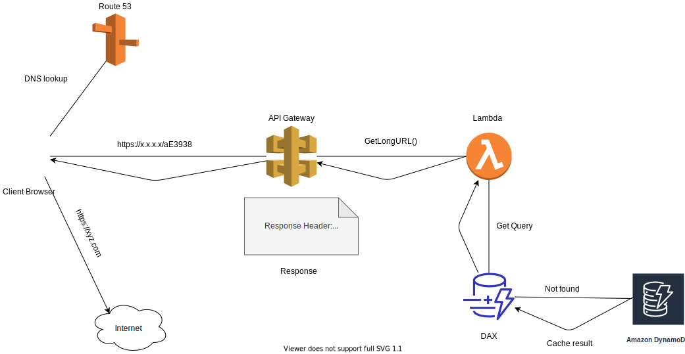

# Shortify
A Chrome and Firefox browser extension for URL shortening service deployed on AWS using serverless stack.

## Why an extension for this service? 
It is intuitive to make this service via extension as end user do not need to move away from the webpage to another website having this service just for shortening a URL. It is a distraction, which is not a good thing from user interaction perspective. 

Therefore, loading this service as an extension the end user can do the same work on the same webpage with just one click.

## Tech Stack
    This application is developed with serverless AWS tech stack: 

    1. AWS cloudformation -- Infrastructure as code
    2. API Gateway        -- Application HTTP endpoint
    3. Lambda             -- Application logic 
    4. DynamoDB           -- NoSQL DB for storage
    5. DAX                -- DynamoDB accelerator for faster read access
    
    Languages: 
     JavaScript
     Java
     HTML
     CSS

## Architecture and flow: 
 ### Flow-one
   

## Screenshots

 
    

 
    

