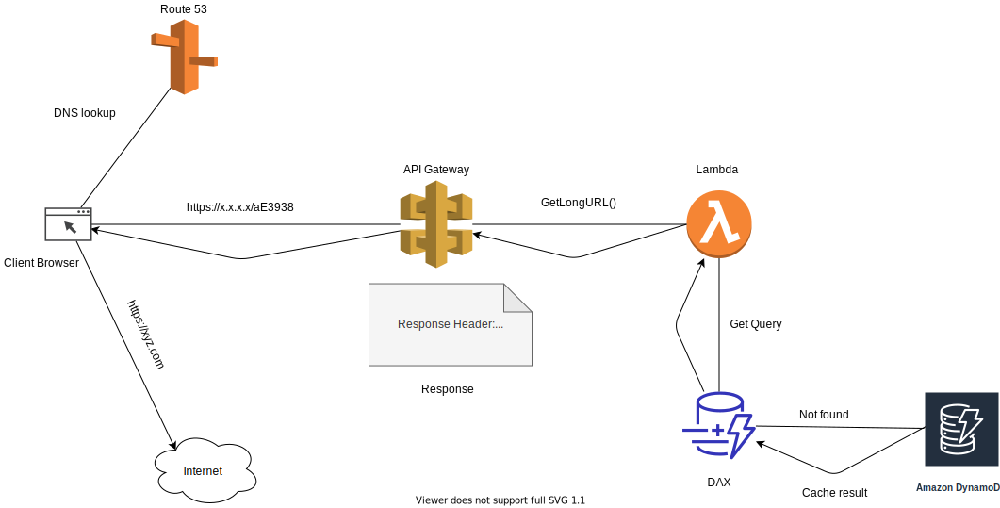

# Shortify
A Chrome and Firefox browser extension for URL shortening service deployed on AWS using serverless stack.

## Why an extension for this service? 
It is intuitive to make this service via extension as end user do not have to move away from the webpage to another URL shortening website just for shortening a URL. It is a distraction, which is not intuitive from user experience perspective. 

Therefore, loading this service as an extension the end user can do the same work on the same webpage with just one click.

## Tech Stack
    This application is developed with serverless AWS tech stack: 

    1. AWS cloudformation -- Infrastructure as code
    2. API Gateway        -- Application HTTP endpoint
    3. Lambda             -- Application logic 
    4. DynamoDB           -- NoSQL DB for storage
    5. DAX                -- DynamoDB accelerator for faster read access
    
    Languages: 
     JavaScript
     Java
     Others: HTML, CSS

## Architecture and flow: 
 ### Flow-one (Creating a short URL)
   
 ### Flow-two (Fetching the original URL using short URL)
   

## Screenshots

 
    

 
    

## How to install
    1. Clone the project
    2. Open chrome
    3. Type chrome://extensions/ in address bar
    4. Enable developer mode on the top right corner
    5. Click on Load unpacked
    6. Navigate to cloned project location: Frontend
    7. Load package
    8. Shorify extension is now added to browser
    
